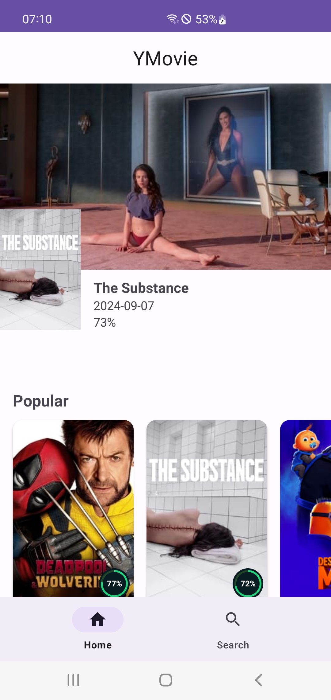
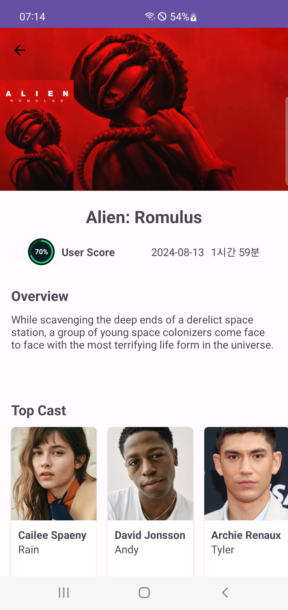
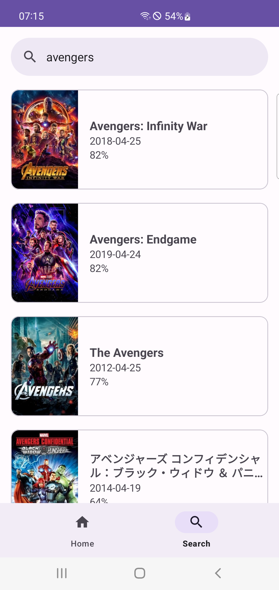

# YMovie
This is an simple movie app for android.
Trying to understand android architecture basic and how to use modern android development skills.
I am gonna convert to Kotlin and Jetpack Compose later.
I hope someones helpful this project.

## Screenshots
|  |  |  |
|---------------------------------------------------|-----------------------------------------------------|-----------------------------------------------------|

## Architecture
YMovie references the [official architecture guidance](https://developer.android.com/topic/architecture).

## TMDB
YMovie uses TMDB API. To use API you need to TMDB API keys.
- [TMDB](https://developer.themoviedb.org/docs)

Once you get the key, you can set in `NetworkConstants.kt`:
```
TMDB_ACCESS_TOKEN_AUTH = "Your API key"
```

## Libraries Used
* Android Architecture Components
    * LiveData
    * ViewModel
* Coroutines
* Flow
* Retrofit
* Gson
* Glide

## Do next
Will be development with:
- [x] Kotlin
- [x] Kotlin Coroutines
- [ ] Jetpack Compose