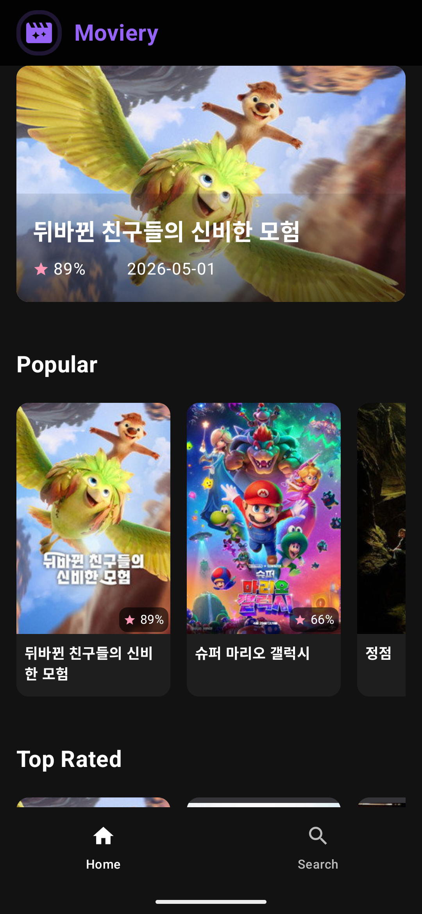
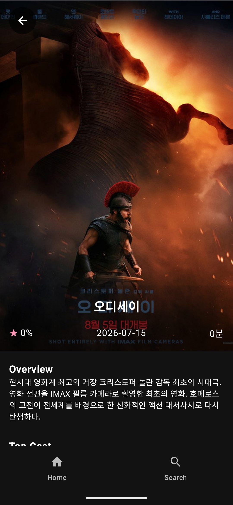
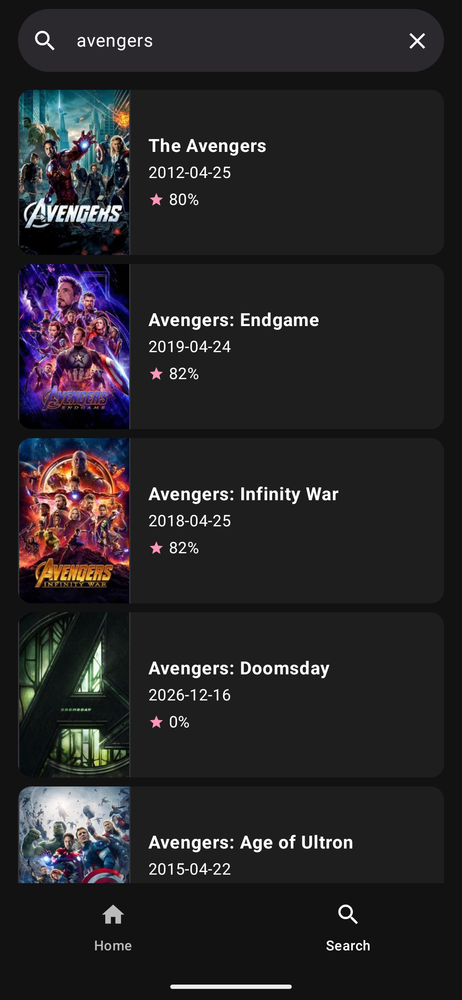
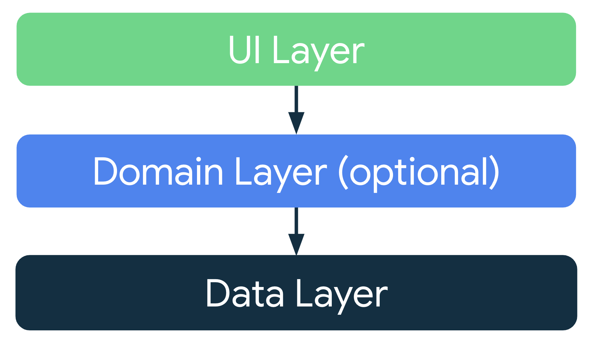

# Moviery

**Moviery**는 TMDB API를 활용하여 영화 정보를 탐색할 수 있는 네이티브 안드로이드 애플리케이션입니다.
최신 안드로이드 개발 트렌드인 **Modern Android Development (MAD)** 기술을 익히고 적용하는 것을 목표로 하였으며 **Kotlin**, **Jetpack Compose** 그리고 **안드로이드 공식 아키텍처**를 기반으로 개발되었습니다.

## 스크린샷
|  |  |  |
|:---:|:---:|:---:|
| 홈 (Home) | 상세 (Detail) | 검색 (Search) |

## 주요 기능
* **영화 목록 조회**: 현재 상영작, 인기작, 높은 평점작, 개봉 예정작 등 다양한 카테고리별 영화를 목록 형태로 제공합니다.
* **영화 상세 정보**: 영화 포스터, 제목, 평점, 개요(Overview) 및 출연진(Cast) 정보를 확인할 수 있습니다.
* **영화 검색**: 키워드를 입력하여 원하는 영화를 검색할 수 있습니다.

## 기술 스택
* **Language**: Kotlin
* **UI Framework**: Jetpack Compose
* **Asynchronous**: Kotlin Coroutines & Flow
* **Network**: Retrofit2, OkHttp3, Gson
* **Image Loading**: Coil
* **Navigation**: Jetpack Navigation Compose
* **Build System**: Gradle (Kotlin DSL)

## 아키텍처
이 프로젝트는 [안드로이드 공식 아키텍처](https://developer.android.com/topic/architecture)를 따릅니다.


이미지 출처: [안드로이드 공식 문서](https://developer.android.com/topic/architecture)

**UI Layer**
* **View**: Jetpack Compose로 구현된 `Screen`들이 `ViewModel`이 노출하는 `UiState`를 구독하여 화면을 그립니다.
* **ViewModel**: Repository로부터 데이터를 가져와 UI 상태로 변환하며 비즈니스 로직을 담당합니다.

**Data Layer**
* **Repository**: 데이터 소스와 UI의 중개자로서 MovieDataSource로부터 데이터를 가져와 UI에 맞는 데이터로 가공합니다.
* **Data Source**: Retrofit을 통해 TMDB API와 통신합니다.

## 패키지 구조
```text
app
├── data
│   ├── model       # API 응답 데이터 클래스
│   ├── source      # RemoteDataSource
│   └── MovieRepository.kt
├── network
│   ├── service     # Retrofit Interface 정의
│   └── RetrofitClient.kt
├── ui
│   ├── detail      # 상세 화면 및 ViewModel
│   ├── home        # 홈 화면 및 ViewModel
│   ├── search      # 검색 화면 및 ViewModel
│   ├── view        # 공통 UI 컴포넌트
│   └── MainActivity.kt
└── util
```

## 환경 설정
이 앱은 TMDB API를 사용하므로 API 키 설정이 필요합니다.

[TMDB](https://developer.themoviedb.org/docs)에 가입 후 API Access Token을 발급받습니다.
프로젝트 최상위 경로 `local.properties` 파일에 아래의 내용을 추가합니다.
```
TMDB_ACCESS_TOKEN_AUTH = "Your API key"
```

## 사용 라이브러리
**UI**
* **Jetpack Compose**

**Jetpack**
* **ViewModel**
* **Lifecycle**
* **Navigation**
* **LiveData**

**Network & Async**
* **Retrofit2**: REST API 통신
* **OkHttp3**: 네트워크 통신 로그 및 인터셉터
* **Gson**: JSON 데이터 파싱
* **Kotlin Coroutines & Flow**: 비동기 프로그래밍

**Third Party**
* **Coil**: Jetpack Compose 전용 이미지 로딩
* **LeakCanary**: 메모리 누수 탐지 및 디버깅

## 기술적 고민
**아키텍처 선정 (공식 아키텍처 대 클린 아키텍처)**

앱이 소규모이고 대부분의 앱은 서버가 비즈니스 로직을 가지고 있어 서버에 강하게 의존되어 있기 때문에 (서버 API 중심) 도메인 계층이 필수적이진 않다고 생각했고 필요 시 추후에 추가할 수 있고 도메인 계층을 강제하지 않는 안드로이드 공식 아키텍처를 선택하였습니다.

**이미지 라이브러리 선정 (Glide 대 Coil)**

기존 안드로이드 생태계에서 유명한 Glide 라이브러리가 프로젝트 의존성에 포함되어 있었으나 Jetpack Compose 환경에서는 코루틴 기반의 가볍고 Compose 친화적인 Coil이 더 적합하다고 판단하여 UI 구현에는 Coil을 사용했습니다.